# WORDLE HANGMAN
Wordle hangman is based on the traditional pen and paper game. You can read more about it on [Wikipedia](https://en.wikipedia.org/wiki/Hangman_(game)).  I have also encorporated the concept of the hugely popular 5 letter word guess game, Wordle. Hence, every word that the player has to guess is 5 letters in length.  
The player enters their name. The player is then presented with a list of 6 word categories to choose from. The player chooses which category they wish to guess a word from. The word categories and their corresponding words are found in a google sheet (Wordle-Hangman). A word is picked by random from the players choosen category; this word is hidden from the player. 
The player has 5 attempts to guess the word; one letter at a time.  Like the traditional hangman game, each time the player guesses an incorrect letter, an item is added to the graphical representation of the hanging gallows:
- 1 incorrect word - a head.
- 2nd incorrect word - the body.
- 3rd incorrect word - both arms.
- 4th incorrect word - both legs.

# Project Files
- run.py
- dictionary.py
- hangman.py
- hangman_parts.py
- Wordle-Hangman google sheet

# Features

## Existing Features
- Category Selection 
    - A player can choose the category of interest (from which the word to be guessed is sourced) by entering the associated number of that category e.g. 1. Countries. . These categories are presented to the player in the form of a list on the terminal. The categories are pulled from a google sheet.   
    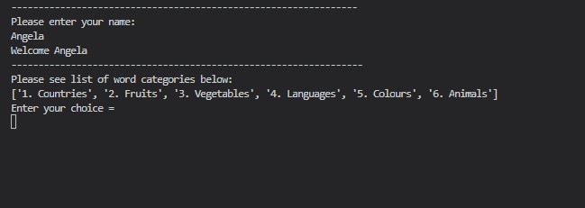 
    
- Random Word generation
    - A word is randomly 'pulled' from the player selected category from the google sheet (Wordle-Hangman) and presented to the player as a series of five underscores. This is the word the player has to guess.
- Guess checking. The game accepts the players guess, one letter at a time. Incorect guesses are stored in a incorrect list, and displayed to the terminal. Each correct letter guessed is placed in the location of the appropriate underscore in the correct words list.   
 
- Data validation on player category choice and on player guesses . 
    - Player cannot enter a category number < 1 or >=7, as these are not valid category numbers. There are presently words for only 6 categories in my google sheet. In addition a player cannot enter a letter in error instead of a number.  
    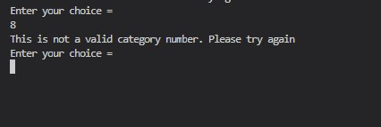  
    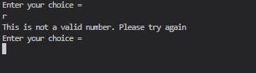   
    - Player cannot enter a number instead of a letter for their guess.   
    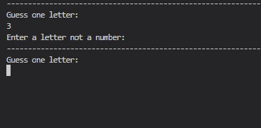
    >
    - Player may enter a number of letters in each guess experience, but only the first letter of the string entered is accepted as the valid guess letter for that guess. 
    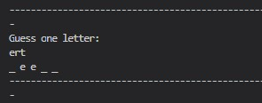  
    - Player will be allerted if they have entered an incorrect letter already entered in a previous guess.   
    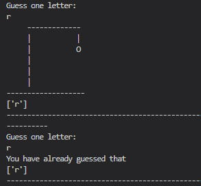 
 
- Guess Tracking in the form of a list of incorrect guesses displayed on screen and the 
correct words entered into the appropriate underscore. 
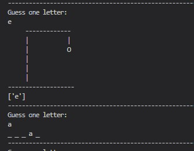 
- Graphical representation of gallows with elements added each time player guesses an incorrect word. (stored in the hangman_parts.py) 
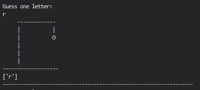 
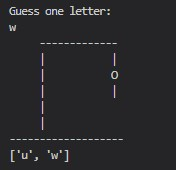 
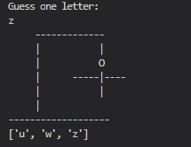 
  
- Data maintained in class instances (There are 2 classes in my code; class Hangman in hangman.py and class Dictionary in dictionary.py)
- A play again Y/N feature. 
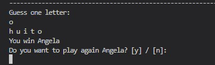 
- Once the Players name is captured, it is followed through the game to personalise the gaming experience (see image above). In addition, if the player chooses to play another game, their name is carried through also; hence they do not have to re-enter their name.

## Future Features
- Allow player to select to guess longer words, instead of just 5 letter words e.g. 8/10 letters
- Allow player to select to guess words of higher difficulty levels.
- Allow player the option to make an outright guess of the word, instead of one letter at a time; maybe after a number of one letter guesses first.
- Allow player to play against the computer. Here the computer will make random alphabetical guesses.

# Data Model
I decided to use a Dictionary class (in dictionary.py) and a Hangman class (in hangman.py) as my models. The game creates an instance of the Dictionary class whose purpose is to ultimately generate a random guess word from the players choosen category (sourced from the google sheet, Wordle-Hangman). 
- The Dictionary class stores the spreadsheet, the word_categories, the picked (category), and the random word. 
The Dictionary class also has methods such as the print method to print out the categories list, the __choose_category method to enable the player to choose from the categories list, and the select_random_word method to randomly pick one word from the players choosen category as the game guess word.
- The Hangman class contains all the methods to actually play the game, such as the play_game(self, random_word, player_name) method. 

# Testing
I have manually tested my project by doing the following:
- Passed the code through a PEP8 linter and confirmed there are no problems.
- Passed in incorrect inputs for the category (choosen by the player at the start of the game). I entered a category number of 0 and a category number of 8. I also entered a category number in the form of a letter e.g. r. On both occasions the error message, "This is not a valid number appeared".
- Passed in incorrect inputs for the player guess (the guess must be one letter). I entered a number instead of a letter. The error message " Enter a letter not a number appeared". I entered a string of letters for another test, the game only accepted the first letter of this string as the guess letter.
- Passed in the same letter as previously guessed; the following error message appeared, "You have already guessed that".
- Tested in my local terminal & The Code Institutes Heroku terminal

# Bugs
## Solved Bugs
- When I picked the 6th category in my game, I got an error message, even though there are 6 categories in the categories list. This is because of the indexing in the list of categories i.e. [0 index, 1 index, 2 index, 3 index, 4 index, 5 index]. I fixed this by adding [choice -1] where necessary.
- Numerous indentation errors causing chunks of code from not running at all.
- I inadvertantly omitted the *continue* in my While loop in the  __choose_category method, causing an infinite loop!

## Remaining Bugs
- No bugs remaining

## Validator Testing
I added the PEP8 Validator to my gitpod workspace. Hence my PEP8 errors were highlighted in red. These errors only related to 'lines too long' and 'too many blank lines'. I have rectified all these errors.

# Deployment
The project was deploying using Code Institutes mock terminal for Heroku.
- The steps for deployment:
    

# Credits
https://www.geeksforgeeks.org/python-convert-list-of-lists-to-list-of-strings/

hangman videos that helped me along

1. https://www.youtube.com/watch?v=Ff--def_1q0
2. https://www.youtube.com/watch?v=7sVnul-StrU

data validation:

https://www.educba.com/python-validation/

    
        

